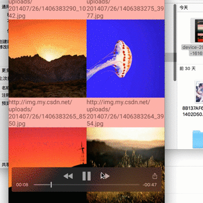
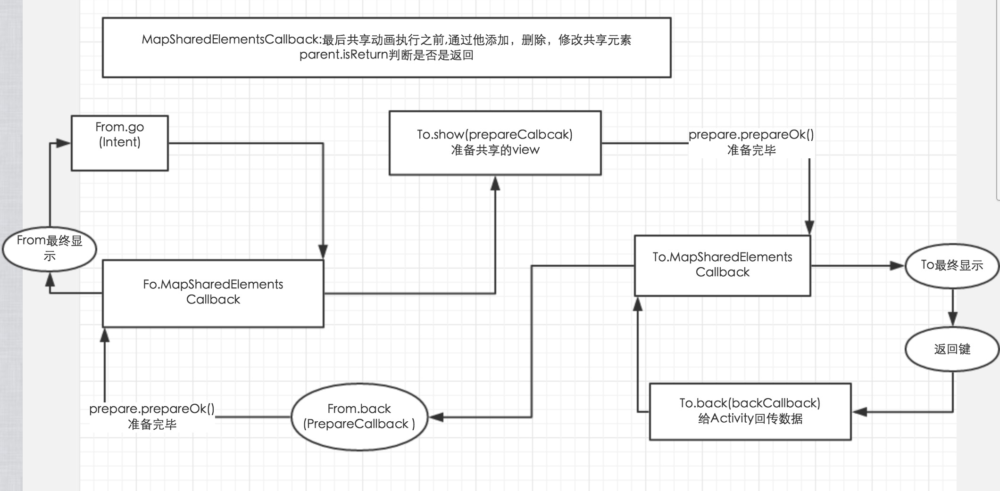

#### [Transition框架的总结](./Transition框架的总结.md)

### JicPack
Add it in your root build.gradle at the end of repositories:
```
allprojects {
    repositories {
        ...
        maven { url "https://jitpack.io" }
    }
}
```
Step 2. Add the dependency

> compile 'com.github.luhaoaimama1:zone-sdk:[Latest release](https://github.com/luhaoaimama1/LollipopTransition/releases)'
    
#Demo演示
[视频链接地址](http://t.cn/Rtnic2i)

##5.0Activity动画
5.0动画跳转的特殊方式；
>主要是准备场景Scene

```
  ShareTransition.from(this)
                 .go(new Intent(this, FiveContentAcitivity.class).putExtra("flag", flag));
```
设置5.0Acvitity动画
```
  NormalTransition.activityAnimation(this)
                         .enterTransition(new Slide(Gravity.LEFT))
                         .returnTransition(new Slide(Gravity.RIGHT));
                       //.enterTransition(R.transition.content_explore);
```


##共享动画 
>流程图
>Tips:MapSharedElementsCallback 共享动画执行之前最后走的；


####1.普通的共享动画使用；
第一个Activity
```
 ShareTransition.from(this)
                .pairs(findViewById(R.id.iv),findViewById(R.id.bg))
                //.pairs(R.id.iv,R.id.bg) ids的形式
                .go(new Intent(this,FiveShareNormal2_LibAcitivty.class));
```
第二个Activity 
```
 ShareTransition.to(this)
            .setContentView(R.layout.activity_share_normal2)
            .pairs(R.id.iv, R.id.bg)
            .show();
```

####2.list与Activity(ViewPager可切换)使用的范例 demo里有；
```
 ShareTransition.from(FiveShareList_LibAcitivty.this)
                .pairs(view.findViewById(R.id.ivv))
                .onMapSharedElements(new MapSharedElementsCallback() {
                    @Override
                    public void onMapSharedElements(List<String> names, Map<String, View> sharedElements, Parent parent) {
                        ...
                    }
                })
                .go(intent)
                .back(new From.PrepareCallback() {
                    @Override
                    public void prepare(int resultCode, Intent data, final Prepare prepare) {
                                 ...
                                prepare.prepareOK();
                            }
                        });
                    }
                });
```
第二个Activity
```
 ShareTransition.to(this)
                .setContentView(R.layout.activity_sharepic)
                .onMapSharedElements(new MapSharedElementsCallback() {
                    @Override
                    public void onMapSharedElements(List<String> names, Map<String, View> sharedElements, Parent parent) {
                          ...
                       }
                })
                .show(new To.PrepareCallback() {
                    @Override
                    public void prepare(Prepare prepare) {
                            ...
                           prepare.prepareOK();
                    }
                })
                .back(new To.BackCallBack() {
                    @Override
                    public void setResult(Back mBack) {
                        mBack.setResult(233, new Intent().putExtra("position", vpHelper.getCurrentPostion()));
                    }
                });
        //上边相当于setContent
        ButterKnife.bind(this);
```


